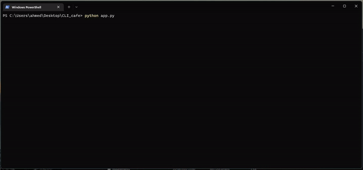
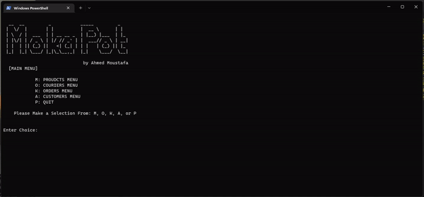
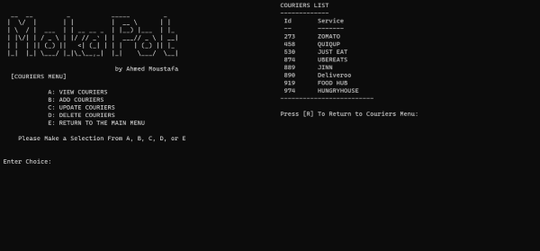
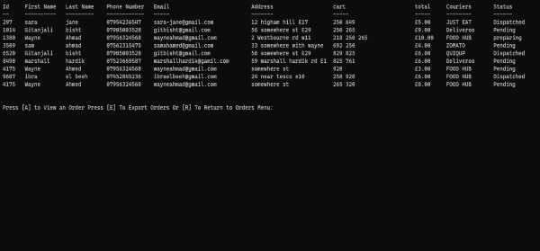
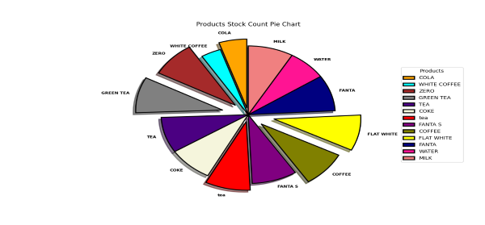

# MOKA POT 


# Overview

## The Problem:

The client has launched a pop-up cafe in a busy business district. They are offering delivered home-made lunches and refreshments to the surrounding offices. As such, they require a software application which helps them to log and track orders.


## My Solution:

To buid a Python based CLI application for the pop-up cafe, that will allow the user to create/track orders for their customers, and performe CRUD operations for their data and store that data in a MySQL database.





# As a user you will be able to:
``` 
. Create new a product, courier, or orders

. View all products, couriers, or orders

. Update the status of an order

. Persist your Data

. Delete or update a product, order, or a courier

. Data visualisation (STOCK) in a pie chart

. Export Data into a CSV
```


# Features: 

## View all products and stock availability



## View all couriers



## View all Orders or a Data visualisation 




## Data visualisation (STOCK) in a pie chart




# Getting Started:

1. Clone the repo<br/>

Under the repo name click *clone or download*<br/>
Click on *use HTTPs*, copy the clone URL of the repo<br/>
In the terminal go on the working directory where you want to clone the project<br/>
Use the `git clone` command and paste the clone URL then press enter :

```shell
$ git clone https://github.com/ahmedm89/cli_cafe_app.git
```

2. On your local machine go inside of the *pop-up-cafe* directory :

```shell
$ cd cli_cafe_app
```

### Create Docker Container for MySQL DB:

1. Ensure you have Docker Desktop installed and running (you can check with `docker -v`).
2. Run the following command **inside** the directory in a terminal. This will create both the client and server for us which is running on localhost.

```
$ docker-compose up -d
```

​	You should get the following output:

```sh
Creating mysql_container   ... done
Creating adminer_container ... done
```

3. Navigate to the following URL to ensure that you can see the `Adminer` interface:

http://localhost:8080/

4. Fill in the username (`root`) and password field (`password`), leave the database field blank.

5. Select `SQL Command` on the left.
6. We'll create our own database with:

```
CREATE DATABASE popup_cafe or what ever you want to call it just make sure the the names do match;
```
7. We'll create our tables with the following:
```
create table Products (prod_id INT NOT NULL AUTO_INCREMENT, prod_name VARCHAR(255), prod_price FLOAT, PRIMARY KEY (prod_id));
```
```
create table Couriers (c_id INT NOT NULL AUTO_INCREMENT, c_name VARCHAR(255), c_number BIGINT, PRIMARY KEY (c_id));
```
```
create table Orders (order_id INT NOT NULL AUTO_INCREMENT, order_name VARCHAR(255), order_add VARCHAR(255), order_phone INT, order_courier VARCHAR(255), order_status VARCHAR(255), order_items VARCHAR(255), PRIMARY KEY (order_id));
```


# Creating And Activating The Virtual Environment:

## Creating the virtual environment


On macOS and Linux:

```
python3 -m venv .venv
```
On Windows:


```
py -m venv .venv
```

## Activate the virtual environment

On Windows:
```
$ source venv/Scripts/activate
```


MacOS/Unix:

```
$ source venv/bin/activate
```

# Prerequisites:

## The requirements to run the project are:
```
PyMySQL==0.10.1

python-dotenv==0.15.0

six==1.15.0

playsound==1.3.0

matplotlib==3.5.2
```

## To install these requirements, run in the terminal:

```shell
$ pip install -r requirements.txt

```


# Usage:

## Running the program
```
Access the directory of the cli_cafe_app through the command prompt:

. cd [File Path]

. Then enter:

. python app.py

. The program will prompt the user for their input at different stages.

. Instructions are provided within the program to ensure that the user enters the correct input.
```

## Exiting the program
```
. You can Choose to Exit the program by inputting 'P' 

. You will be pormpted with 'ARE YOU SURE YOU WANT TO LEAVE' [Y : N] 

. Choose 'Y' when prompted to end the session Or 'N' to remain
```

## The Process:


. Every week, I received a new markdown with tasks/updates to complete. We were learning new content, and then applying what we had learned to the project - this meant that week by week, the tasks gradually became more advanced.

. I started with temporary lists of products and couriers in our code to create, read, update and delete products and couriers from lists.

. I moved to text files for persistence, so I had to read from and write to external files instead of temporary lists.

. Next, wI created a temporary dictionary of orders, since the order data were two-dimensional (it included a customer's name, address, phone, courier, status and the items they ordered), unlike the product or courier lists which were one dimensional.

. The next task was to move our products, couriers and orders to CSV files (so we added prices to our products and phone numbers to our couriers to make them two-dimensional). From the CSV files, I loaded the data as dictionaries, rather than lists. This completely changed how I accessed variables, especially when needing to update data from user input.

. In week 5 and 6 of this project, The task was to maintain all of our data in a database. I used Docker to set up MySQL databases locally, and used the MySQL commands to create tables, insert into them, and update or delete directly from Database.


